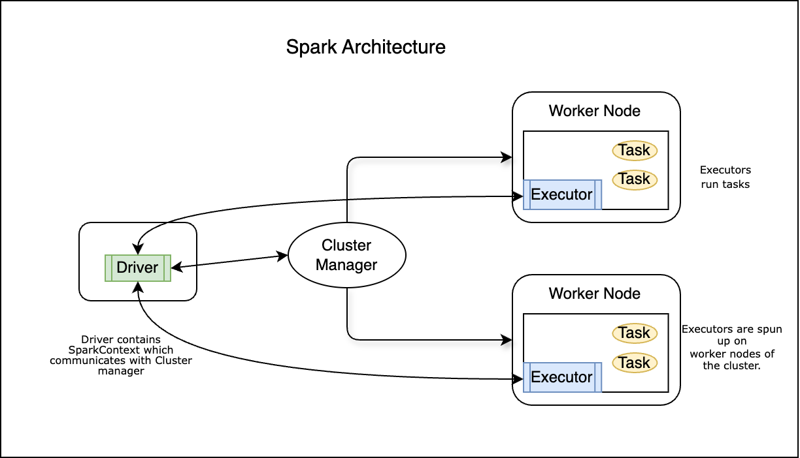

# Apache Spark Architecture

Spark is a popular Data scientist tool for analysis of large datasets. The main question is how does spark handle large datasets in a distributed manner and why is it so fast? This tutorial explains the high-level architecture of Spark to answer these questions.

## Common Terminologies

Apache Spark follows master-slave style architecture which consists of **driver** process which acts as a master for the application and many **executors** which runs on worker nodes in the cluster of machines. This tutorial explains how Spark runs in cluster mode which is the most common way to use Spark. Let's go over some of these terms first.

- **Driver:** This is the main process running the Spark application and is responsible for creating `SparkSession` and `SparkContext`. It runs the `main()` function of the application. Driver is also responsible for coordinating the execution of the Spark application.
- **Executors:** It is a process which is launched on the worker nodes of the cluster. Executors run smallest unit of work called tasks and keeps data for processing in memory or on disk. Each running application is assigned its own set of executors.
- **Cluster Manager:** This is an external service which helps acquire resources for performing computation. There are standalone manager, Mesos, YARN and kubernetes which can be used as cluster manager. YARN is the most common one as a part of Hadoop cluster deployment.
- **Job:** This is a set of parallel computation which consists of multiple tasks that starts as a part of some action in the application code. The term *action* will be explained in the subsequent section, but think of it like performing some work like save, persist or collect.
- **Stage:** Each job gets divided into smaller sets of tasks which is called stage. These stages depend on each other and cannot run in parallel. This is like sequential set of actions to be performed.
- **Task:** A task is smallest unit of work in Spark application. A task can be performed on a single partition of data in the cluster. The driver program analyzes the application code and divides the job into tasks and assigns them to the executors for execution.

## Spark Architecture

The driver program actually contains the application code in the `main()` function. The driver collaborates with cluster manager to launch the executors across the cluster and also controls the task executions. Executors are processes running on the worker nodes in cluster. In this, the individual tasks or computations are run. When driver connects to the cluster manager, the cluster manager assigns resources to run executors. The cluster manager is responsible for the scheduling and allocation of resources across the compute nodes in the cluster.

`SparkContext` is the main entry point to the Spark program. It represents the connection to the cluster. Once resources are assigned by the cluster manager, Spark acquires those executors on nodes in the cluster. Next, it sends the application code (usually in JAR or Pythong files) to the executors. `SparkContext` can be used to create RDDs, accumulators and broadcast variables on the cluster. You must `stop()` the active SparkContext before creating a new one.

The Directed Acyclic Graph(DAG) are created by Driver program. DAG is executed in stages and tasks by the task scheduler by communicating with the cluster manager for resources. A DAG represents a job and a job is split into subsets called stages and each stage is executed as task using one core per task. The number of stages and what the stages consist of is determined by the kind of operations defined in the application code. The driver program also listens for and accepts incoming connections from the executors throughout its lifetime.

Each executor is assigned its own set of memory which can be used to store data from a particular partition. A single executor can perform multiple tasks one after another.
